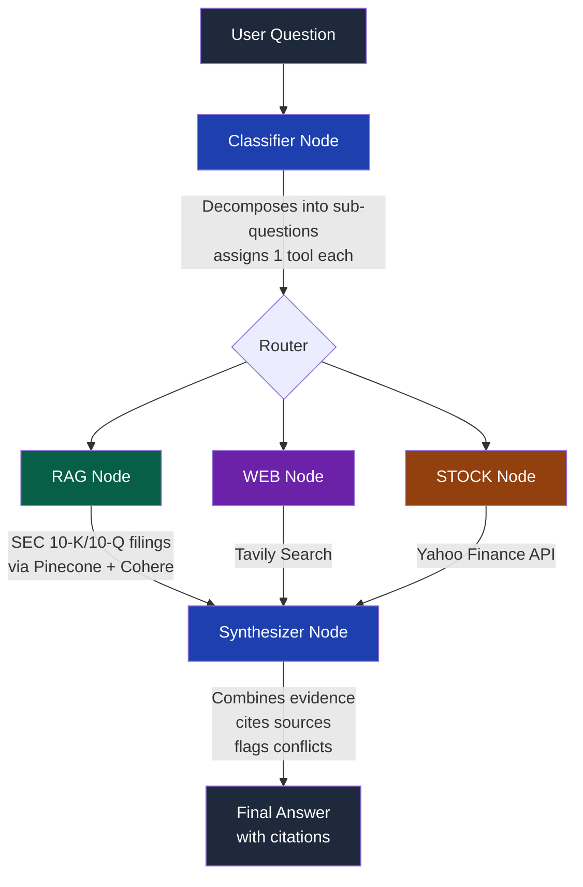

<div align="center">

# Investment Research AI

### Multi-Agent RAG System for Financial Analysis

*An AI research assistant that thinks like an analyst — decomposing complex investment questions, pulling data from the right source at the right time, and citing every claim back to its origin.*

[](https://nodejs.org/)
[](https://www.langchain.com/langgraph)
[](https://www.pinecone.io/)
[](https://cohere.com/)
[](https://groq.com/)

</div>

---

🚀 **[Try it live](https://investment-research-bot.vercel.app/)**

## 🎯 What This Is

Most "AI finance chatbots" just wrap an LLM around a prompt. This is different.

This system treats investment research as a **multi-step reasoning problem**, not a single API call. Ask it something like:

> *"Compare NVIDIA vs AMD's data center revenue growth, recent news sentiment, and stock performance"*

...and it doesn't just guess an answer. It **decomposes the question**, figures out exactly which sources it needs (SEC filings? Web news? Live stock data?), retrieves only what's relevant, and **synthesizes a cited, evidence-backed answer** — the way a real analyst would work through the problem.

Built as a learning project to go deep on production RAG architecture, agent orchestration, and LLM systems design — not just prompt engineering.

---

## 🖼️ How It Works



**Key design decision:** Every tool node is *conditionally* executed. If a question only needs stock data, the graph skips RAG and WEB entirely — no wasted LLM calls, no wasted latency.

---

## ⚙️ Core Architecture

### 1. Question Decomposition
An LLM classifier breaks the user's question into minimal, atomic sub-questions and assigns **exactly one tool** to each — `RAG`, `WEB`, or `STOCK`. No sub-question is allowed to need multiple tools; if it would, it gets split further.

```json
{
  "subQuestions": [
    { "question": "What was NVIDIA's data center revenue growth in FY2024?", "tool": "RAG" },
    { "question": "What is the recent news sentiment on AMD's data center business?", "tool": "WEB" },
    { "question": "What is NVIDIA's current stock price and 1-year performance?", "tool": "STOCK" }
  ],
  "requiredTools": ["RAG", "WEB", "STOCK"]
}
```

### 2. Dynamic Metadata Filtering (the RAG core)
Instead of hardcoding "search NVIDIA docs" logic, an LLM **extracts filters directly from each sub-question** at runtime:

```json
{
  "companies": ["NVIDIA"],
  "years": [2024, 2025],
  "searchQuery": "data center revenue growth 10-K filing"
}
```

These filters are applied to Pinecone **before** the similarity search runs — meaning the vector DB only searches within the relevant company + fiscal year, instead of searching all documents and hoping the right one surfaces. This cut irrelevant retrievals dramatically and made results far more precise.

### 3. Conditional Routing (LangGraph)
Built as a state graph with conditional edges — not a fixed pipeline:

```javascript
function routeAfterRag(state) {
  const required = state.requiredTools;
  const executed = state.toolsExecuted;

  if (required.includes("WEB") && !executed.includes("WEB")) return "web";
  if (required.includes("STOCK") && !executed.includes("STOCK")) return "stock";
  return "synthesizer";
}
```

If a question only needs RAG, the graph goes straight to synthesis — WEB and STOCK nodes never execute. This isn't just an optimization; it's central to making a multi-tool agent system actually production-viable (fewer LLM calls = fewer rate limit issues, lower latency, lower cost).

### 4. Evidence-First Synthesis
Every sub-answer is stored with its source (company, fiscal year, page number for docs; URL for web; ticker for stock). The final synthesizer node combines all evidence into one coherent answer, cites every claim, and explicitly flags **conflicting information** between sources (e.g., a 10-K reporting one growth figure vs. a news article reporting another) instead of silently picking one.

---

## 🛠️ Tech Stack

| Layer | Technology | Why |
|---|---|---|
| **Orchestration** | LangGraph | State machine with conditional routing — treats the agent as a deterministic workflow, not an autonomous black box |
| **LLM Framework** | LangChain.js | Tooling for prompts, retrieval, and chains |
| **LLM Inference** | Groq (`gpt-oss-120b` + `llama-3.3-70b`) | Hybrid model strategy — smart model for reasoning (classifier, synthesis), fast model for simple extraction, to double effective rate limits |
| **Embeddings** | Cohere (`embed-english-v3.0`) | Reliable, generous free tier, strong performance on financial English text |
| **Vector DB** | Pinecone | Metadata-filtered similarity search |
| **Web Search** | Tavily | Real-time news and analyst sentiment |
| **Market Data** | Yahoo Finance (`yahoo-finance2`) | Free, no-key-required stock price & historical performance data |
| **Backend** | Node.js + Express | REST API serving the LangGraph agent |
| **Deployment** | Railway (Docker) | Containerized deployment |

---

## 📚 Data Sources

Currently indexed: **SEC 10-K filings** for NVIDIA, AMD, and Microsoft (fiscal years 2024–2025).

Each document is:
1. Loaded page-by-page (preserving page numbers for citation)
2. Chunked at ~1000–1500 tokens with 200-token overlap
3. Tagged with metadata extracted from the filename: `company`, `fiscal_year`, `page`, `source`
4. Embedded and upserted into Pinecone

This metadata is what makes filtered retrieval possible — search is scoped to `{ company: "NVIDIA", year: 2024 }` instead of searching the entire corpus.

---

## 💡 What I Learned Building This

- **Production RAG is 10% vector search, 90% orchestration.** The hard problems aren't embeddings — they're deciding *when* to retrieve vs. search vs. calculate, and how to structure state across multiple LLM calls.
- **Metadata design determines retrieval quality.** Dynamic, LLM-extracted filters scale far better than hardcoded company/year logic.
- **Conditional execution matters more than it seems.** Treating tool execution as optional (not sequential-always) cut LLM calls significantly and was the difference between a system that rate-limits constantly and one that doesn't.
- **LLMs don't always return clean JSON.** Some models wrap responses in markdown code fences — always sanitize before parsing.
- **Evidence tracking should be built in from day one**, not bolted on. Citing sources (page numbers, URLs, tickers) is what makes an answer trustworthy instead of just plausible-sounding.

---

## 🚧 Current Limitations & Next Steps

- No formal retrieval evaluation pipeline yet (currently tested manually against sample queries)
- Corpus is small (6 documents) — incremental ingestion for larger corpora not yet built
- No hybrid search (semantic-only currently) — keyword/full-text search + reranking is a planned addition
- No caching layer for repeated queries

---

<div align="center">

**Built to understand production RAG systems from the ground up — one node at a time.**

</div>
