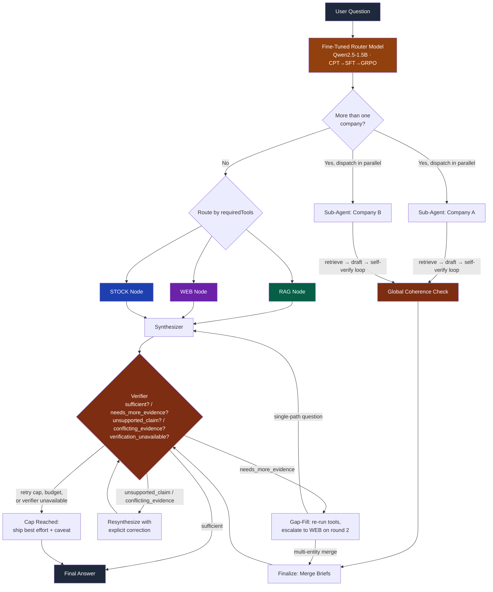

<div align="center">

# Investment Research AI

### A Self-Correcting Multi-Agent RAG System with a Self-Fine-Tuned Router

*An AI research assistant that thinks like an analyst — a custom-trained routing model decomposes
investment questions, pulls data from the right source at the right time, checks its own answer
against the evidence before showing it to you, and fixes itself when it's wrong.*

[](https://nodejs.org/)
[](https://www.langchain.com/langgraph)
[](https://huggingface.co/IbrahimKhan7208/investment-research-router)
[](https://www.pinecone.io/)
[](https://cohere.com/)
[](https://groq.com/)
[](https://openrouter.ai/)
[](https://ai.google.dev/)

</div>

---

🚀 **[Try it live](https://investment-research-bot.vercel.app/)** · 🤗 **[Router model on Hugging Face](https://huggingface.co/IbrahimKhan7208/investment-research-router)**

## 🎯 What This Is

Most "AI finance chatbots" wrap a general-purpose LLM around a prompt and hand you whatever it produces on the first try. This system is built around a different premise: **an answer isn't done just because a model finished writing it.**

There are three ideas layered on top of each other here.

**First, the routing layer isn't prompted — it's trained.** Instead of asking a large general model to classify every question, I fine-tuned a small model (Qwen2.5-1.5B) specifically for this task, through a full **CPT → SFT → GRPO** pipeline, and deployed it as its own inference endpoint. It replaces two LLM calls the original prototype made per question with one structured-output call, from a model an order of magnitude smaller — and it's *more* accurate at the job than the general-purpose model it replaced.

**Second, retrieval isn't just "search and hope."** SEC filings are converted through a purpose-built pipeline that treats a company's actual financial statement numbers as structured data (pulled from SEC's own XBRL layer) rather than something to re-derive by parsing HTML tables, and RAG runs a two-lane retrieval strategy that guarantees those numbers surface regardless of how a question is worded, while still using semantic search + reranking where it actually earns its keep — narrative text.

**Third — and this is what turns it from a workflow into an agent — the system checks its own work and acts on what it finds.** After every answer is written, a separate verification pass reads it back against the actual evidence and renders one of four verdicts: the answer is sufficient, it's missing evidence, it contains a claim the evidence doesn't support, or the evidence itself conflicts. Each verdict has its own remedy — go fetch the missing piece, rewrite the offending sentence, or surface the conflict explicitly — and the system loops through act → observe → decide again until it's actually right, not just once-through. When a question spans more than one company, it splits into parallel per-company investigations, each independently verified, then reconciles them and verifies *that* merge too, because a comparison built from two individually-correct facts can still be wrong in how it combines them.

Ask something like:

> *"Compare NVIDIA vs AMD's data center revenue growth and recent stock performance"*

...and the router decomposes it, dispatches a separate research agent per company, retrieves only what's relevant, drafts and self-checks each company's brief independently, cross-checks the two briefs against each other for things like mismatched fiscal years, merges them into one answer, and *then* runs that merged answer back through the same fact-check loop one more time before you see it — with every one of those steps streamed live into a per-company trace panel as it happens, not just narrated after the fact.

Built as a deep dive into production RAG architecture, model fine-tuning, and real agentic control flow — not prompt engineering.

---

## 🖼️ How It Works



**Key design decision, extended from v1:** every tool node is still conditionally executed — a stock-only question never touches RAG or WEB. What's new is that the *verification and correction* path is conditional too. A clean answer ends in one pass with zero extra cost; a shaky one triggers exactly the remedy its specific failure needs, bounded by a hard retry cap and a separate wall-clock/tool-call budget so the loop can't run away.

---

## ⚙️ Core Architecture

### 1. Question Decomposition — a Fine-Tuned Model, Not a Prompt

The original prototype used a 120B model for **two** separate calls: a classifier (decompose question → sub-questions + tool) and a filter-extractor (pull company/year/search-query per sub-question). Both are now replaced by **one call to a custom fine-tuned router** — Qwen2.5-1.5B, trained CPT → SFT → GRPO with PyTorch + Unsloth, deployed as its own Hugging Face Space endpoint:

```json
{
  "subQuestions": [
    {
      "question": "What was NVIDIA's data center revenue growth in FY2024?",
      "tool": "RAG",
      "companies": ["NVIDIA"],
      "years": [2024],
      "searchQuery": "data center segment revenue growth"
    },
    {
      "question": "What is NVIDIA's current stock price and 1-year performance?",
      "tool": "STOCK",
      "companies": ["NVIDIA"],
      "years": []
    }
  ],
  "requiredTools": ["RAG", "STOCK"]
}
```

Every sub-question gets exactly **one** tool; if a question would genuinely need more than one, the router splits it further rather than tagging a sub-question with multiple tools.

**Benchmarked against the original two-call, 120B approach:**

| Metric | Original (120B, 2 calls) | Fine-Tuned Router (1.5B, 1 call) |
|---|---|---|
| Tool-routing accuracy (in-scope) | 61.3% | **96.8%** |
| Tool-routing accuracy (out-of-scope companies) | 23.3% (hardcoded 3-company enum) | **100%** (generalizes to any company) |
| LLM calls per question | 2 | 1 (**~35% fewer** overall) |

**This same router output now also decides agentic shape, not just tool routing.** The number of unique companies across `subQuestions` is the mechanical trigger for whether a question runs the single-path flow or fans out into parallel per-company sub-agents (see §5) — deliberately not a semantic judgment call ("does this *sound* like a comparison"), so "NVIDIA's revenue and Tesla's biggest risk factor" — two unrelated asks — correctly triggers the same split as an explicit comparison.

**Known limitation, unchanged:** alias/rename canonicalization (e.g. "Facebook" → "Meta") failed across several correction attempts during training and was left as a known gap — ticker resolution for *current* company names works reliably.

### 2. SEC Filing Ingestion — Structured Data Over Parsed Data

Filings are fetched live from **SEC EDGAR** (free, no key — a compliant `User-Agent` header and self-throttling), not manually downloaded. Ticker → CIK resolution, filing lookup, and structured metadata (filing date, period of report, form type) all come from EDGAR's own APIs.

**The conversion problem most pipelines miss:** SEC filing HTML uses plain `<td>` cells throughout its tables — no `<th>` header row anywhere. Standard GFM table converters silently pass through raw, unconverted HTML on every real filing table because of this. The fix: a custom parser (`tableToProse.js`) that grid-normalizes spans, merges spacer/currency columns, and flattens each row into a labeled prose sentence.

**The bigger realization: don't parse tables for numbers that are already structured data.** `xbrlFacts.js` pulls Item 8's core financial statement figures directly from SEC's `companyfacts` API instead of re-deriving them from HTML — zero parsing risk, each fact arriving pre-attributed to its correct fiscal year.

Every chunk is tagged with `company`, `year`, `section`, and `sourceType` (`xbrl-fact` / `table-prose` / `narrative`) — this tagging is what makes both the retrieval filtering below *and* the agentic gap-fill re-retrieval described in §4 possible.

### 3. Two-Lane RAG Retrieval

Reranking alone wasn't sufficient. Testing surfaced a retrieval-*completeness* gap, not a relevance-ordering one: a bare question like *"What was Apple's revenue in FY2025?"* could fail entirely, because the correct `xbrl-fact` chunk never survived the vector search's stage-one top-K at all. Reranking can only reorder what survives stage one; it can't rescue what never made the cut.

RAG retrieval runs two lanes per sub-question:
- **`xbrl-fact` lane**: fetched via exact metadata filter — no vector-similarity competition, *guarantees* ground-truth numbers are never crowded out by word choice.
- **narrative/table-prose lane**: wide vector search → Cohere rerank (`rerank-english-v3.0`) — this is where reranking earns its keep, filtering a genuinely large, noisy pool of prose.

If the narrative lane comes back empty for the exact requested year, it retries company-only rather than returning nothing, letting the synthesizer see and caveat the actual year each chunk is tagged with. Every retrieval call — Pinecone, Cohere, Tavily — now runs through a shared retry-with-backoff wrapper, and a failed retrieval degrades to a visible "couldn't retrieve this" evidence entry instead of crashing the entire run.

### 4. The Agentic Verification Loop — Checking the Work, Not Just Doing It

This is the layer that makes "agent" an accurate word instead of a marketing one. After synthesis, a separate verifier pass — deliberately run on a *different* model than the one that wrote the draft, so it isn't grading its own homework — reads the finished answer back against the actual evidence bundle and renders exactly one of four verdicts:

| Verdict | What it means | What happens next |
|---|---|---|
| `sufficient` | Every claim traces back to evidence, no unresolved conflicts | Answer ships as-is |
| `needs_more_evidence` | Accurate as far as it goes, but incomplete | Gap-fill: re-run the specific tool the verifier suggests, append the new evidence, resynthesize |
| `unsupported_claim` | States something the evidence doesn't support — an invented number, an invented comparison, a plausible-sounding inference dressed as fact | Resynthesize with the exact offending claim named, using the *same* evidence — no re-retrieval, since the evidence was fine and the writing was the problem |
| `conflicting_evidence` | The evidence disagrees on a material fact and the draft silently picked a side | Resynthesize with an explicit instruction to surface the disagreement rather than resolve it |
| `verification_unavailable` | The verifier call itself couldn't run — a provider error, or the run-wide verifier budget below was already spent | Treated as terminal, same as a cap: ship the current draft with an explicit caveat rather than retry into the same failure |

The loop repeats — synthesize → verify → correct → verify again — until `sufficient`, or until it hits limits designed around three genuinely different failure modes: a hard retry-count cap (keeps asking for more forever), a wall-clock/tool-call budget (each round is individually expensive), and a **run-wide verifier call budget** shared across every verification call in the entire run — every sub-agent's local loop, the global coherence check, and the top-level loop, combined. That third one exists because free-tier Gemini's quota is per-*day*, not per-minute: a single multi-entity question can spend calls across three loops that don't otherwise know about each other, and without a shared ceiling a single heavy question could exhaust the day's quota on its own. If any limit is hit first, the system ships its best current answer with an explicit caveat naming exactly what's still unresolved, rather than silently presenting an incomplete answer with false confidence.

The verification pass on the multi-entity **merge step** specifically gets a tighter cap — one retry, not three. By the time a merged answer reaches this check, its component briefs were already individually verified; this pass is a lighter safety net for merge-introduced errors, not a full second investigation.

Gap-filling itself escalates across rounds rather than retrying the same failed tool indefinitely: round one tries the verifier's suggested tool, round two forces a switch to web search for anything that isn't already a web result, and a gap that's failed via both paths gets explicitly abandoned rather than looped a third identical way.

### 5. Multi-Entity Sub-Agents + Global Coherence Check

When a question spans more than one company, the graph fans out via LangGraph's `Send` primitive into one parallel sub-agent per company. Each sub-agent runs its own complete retrieve → draft → verify → correct loop, in isolation, against only its own slice of evidence — so NVIDIA's brief is never graded against AMD's sources or vice versa.

This matters because a single shared verifier working across mixed evidence can miss exactly the failure this design catches: two individually correct briefs — say, AMD's numbers drawn from its FY2024 filing and NVIDIA's from FY2025 — being compared as if they were the same period. Each company's brief carries structured metadata (`{company, yearsCited, text}`, not just prose) specifically so a **global coherence check**, run after all sub-agents finish, can catch this partly *mechanically* — a direct code comparison of cited years across briefs — before an LLM pass judges the harder, non-mechanical question of whether the briefs actually contradict each other in substance.

The merged final answer then flows back through the *same* verification loop from §4 — a fix added after real testing surfaced a bug the earlier design missed entirely: verifying each company's brief and verifying that the briefs agree with each other still leaves the merge step itself unchecked, which is exactly where a genuine numeric error (a $3,694M figure silently rendered as "$3.694 M" during merge) slipped through in one test run. Checking the parts and checking that the parts agree isn't the same as checking the whole.

That loop is now genuinely closed, not just re-checked: if the post-merge verifier comes back `needs_more_evidence`, gap-fill re-runs the specific tool call and routes back into `finalizeMultiEntity` — a real re-merge with the new evidence — rather than the earlier version, where a bad post-merge verdict was computed and then silently discarded because nothing downstream was listening for it.

### 6. Multi-Provider Model Harness

Three different tasks in this system need three different things from a model, so three different free-tier providers each carry the load they're actually suited for — partly for cost, mostly so no single quota bucket gets hammered by every call in a run (an early version of the agentic loop crashed mid-run against Groq's per-model rate limit because verification, synthesis, and correction were all landing on the same 8000-TPM bucket):

| Role | Task shape | Model | Provider |
|---|---|---|---|
| Extraction | High-volume, called once per sub-question — summarize retrieved chunks into a sub-answer | `openai/gpt-oss-120b` | Groq |
| Drafting | Combine multiple sources coherently, follow citation rules precisely — called a handful of times per run | `openai/gpt-oss-120b` | OpenRouter |
| Verification | Claim-by-claim fact-checking against evidence, structured output, run-wide call budget (see §4) | `gemini-3.5-flash` | Google AI Studio |

The three roles stay on three separate providers even though extraction and drafting currently run the same underlying model — the point of the split isn't which model, it's that no single quota bucket carries every call in a run. Verification in particular needed to be both a *different provider* (so a Groq or OpenRouter outage doesn't also take down the safety net) and a *different model* than whichever one wrote the draft, so it isn't grading its own homework.

Retrieval clients (Pinecone store, Cohere reranker, Tavily, the stock tool) are hoisted to module-level singletons rather than constructed fresh per call — this matters specifically for the multi-entity path, where several `Send`-dispatched sub-agents used to each spin up their own client stack concurrently; now they share one.

### 7. Evidence-First Synthesis

Every sub-answer is stored with its full source metadata — ticker, fiscal year, SEC Item/section for filings; title and URL for web; ticker for stock. Chunks are presented to the synthesizer in trust order (`xbrl-fact` → `table-prose` → `narrative`), with an explicit instruction to prefer the XBRL-sourced figure whenever a table-prose or narrative excerpt reports the same fact. The synthesizer flags conflicting information rather than silently picking one side — and now, that instruction is backed by an actual check rather than just a request, since §4's verifier is specifically watching for exactly that failure.

### 8. Live Agent Trace UI

Every node in the graph above emits a live event over SSE the moment it fires, not just at the end of the run — the frontend was rebuilt around that stream rather than around the finished answer. For a multi-entity question, each company gets its own lane that fills in independently as its sub-agent works, tagged with a "VERIFIED / GAP FOUND / FLAGGED / CONFLICT / CAPPED" stamp the moment its local verifier renders a verdict; a shared trace panel shows the router's decomposition, each tool call's retrieval math (`xbrl-fact` count vs. reranked candidates, articles retrieved, etc.), and every gap-fill escalation or abandonment as it happens. The answer panel itself carries a revision counter that increments each time the verifier sends the draft back for correction — so a resynthesis isn't invisible, it's a visible signal that the system caught and fixed something before you saw it. Evidence is fully expandable, with every source clickable back to its filing section or article.

---

## 🛠️ Tech Stack

| Layer | Technology | Why |
|---|---|---|
| **Router model** | Qwen2.5-1.5B, PyTorch + Unsloth, CPT → SFT → GRPO | Purpose-trained routing beats prompting a general model, at a fraction of the size and cost |
| **Model hosting (router)** | Hugging Face Spaces (Gradio) | Free-tier ZeroGPU inference endpoint |
| **Orchestration** | LangGraph (`Annotation.Root` state, `Send` for parallel dispatch) | Conditional, loopable state machine — parallel sub-agents need explicit merge reducers on shared state, which plain object state can't express |
| **Extraction LLM** | Groq — `openai/gpt-oss-120b` | High-volume per-sub-question summarization, isolated onto its own provider quota |
| **Drafting LLM** | OpenRouter — `openai/gpt-oss-120b` | Coherent multi-source synthesis, isolated from extraction traffic |
| **Verification LLM** | Google AI Studio — `gemini-3.5-flash`, run-wide call budget | Independent model *and* provider grading the draft, not grading its own output |
| **Embeddings + Rerank** | Cohere (`embed-english-v3.0`, `rerank-english-v3.0`) | Strong on financial English text; two-stage retrieval where a single vector search isn't precise enough |
| **Vector DB** | Pinecone | Metadata-filtered similarity search, 1024-dim / cosine |
| **Filing source** | SEC EDGAR (submissions + XBRL companyfacts APIs) | Free, structured, no manual document sourcing |
| **HTML processing** | Cheerio + Turndown + custom table parser | SEC's table markup breaks standard GFM converters |
| **Web Search** | Tavily | Real-time news and analyst sentiment, now also the round-2 gap-fill escalation target |
| **Market Data** | Yahoo Finance (`yahoo-finance2`) | Free, no-key price and historical performance |
| **Backend** | Node.js + Express, deployed on Render | REST + SSE streaming endpoint serving the LangGraph agent |
| **Frontend** | React, deployed on Vercel, SSE via `EventSource` | Live per-node streaming — parallel per-company lanes, verdict stamps, retry/revision counters, expandable evidence with source links |

---

## 📚 Data Coverage

**8 companies**, 3 fiscal years of 10-K filings each (2 for META, pending its most recent filing): NVIDIA, AMD, Microsoft, Apple, Alphabet, Amazon, Tesla, Meta.

**~14,500 chunks** across all companies — narrative, table-prose, and XBRL-fact sourced.

---

## 💡 What I Learned Building This

**From the retrieval/fine-tuning work:**
- Fine-tuning a small model can beat prompting a large one — if the task is narrow enough.
- "Convert HTML to Markdown" is not one problem — real-world documents don't provide clean semantic markup, and that failure mode is silent.
- Structured data beats parsed data whenever it's available.
- Reranking fixes relevance ordering, not retrieval completeness — a narrow top-K can silently drop something reranking never gets a chance to save.

**From building the agentic layer:**
- **Checking your own output requires a second, independent judge — not just a second pass.** Having the same model re-read its own answer doesn't reliably catch its own blind spots; verification needed to be architecturally separate, both in model and in the fact that it can't see or edit the draft while writing its verdict.
- **Verifying the parts is not the same as verifying the whole.** Per-company briefs being individually correct, and briefs agreeing with each other, still left the actual merge step unchecked — and a real numeric scale error (millions rendered as the wrong magnitude) slipped through exactly there until the merged output was routed through the same verification loop as everything else.
- **A verdict changing type between retry rounds isn't a stall, it's often the design working.** One test case went `unsupported_claim` → corrected → `needs_more_evidence` → gap-filled → `sufficient`: removing a hallucinated claim *exposed* a genuine gap that the hallucination had been papering over. Reading that as a bug would have meant patching the wrong thing.
- **A retry loop needs two independent limits, not one.** An iteration cap alone doesn't catch "each round is individually expensive"; a wall-clock/tool-call budget alone doesn't catch "keeps asking for more forever." They're different failure modes and need separate guards.
- **Spreading load across model providers isn't just a cost optimization.** An early version of the loop crashed mid-run on a single provider's rate limit because verification, drafting, and high-volume extraction were all competing for the same quota bucket — splitting them across providers by task shape fixed the crash and happened to also match the right model to the right job.
- **A per-loop retry cap isn't the same guard as a per-quota-period budget.** Each sub-agent's local loop, the global check, and the top-level loop each had their own iteration cap — individually reasonable, but none of them knew about the others, and free-tier Gemini's quota resets *daily*, not per-minute. A multi-entity question spanning several independently-capped loops could spend the day's entire quota on one question. The fix needed a budget that spans the whole run, tracked outside any single loop, not a bigger per-loop cap.

---

## 🚧 Current Limitations & Next Steps

- Formal retrieval/agentic eval pipeline exists as a runnable harness but isn't yet populated with a full question set
- Synthesizer model (separately DPO-trained) built but not yet integrated — deferred by HuggingFace's free-tier ZeroGPU cap of 2 models per Space

---

<div align="center">

**Built to go deep on model fine-tuning, production RAG, and real agentic control flow — from a single fine-tuned classifier to a self-verifying, self-correcting, multi-agent research system.**

</div>