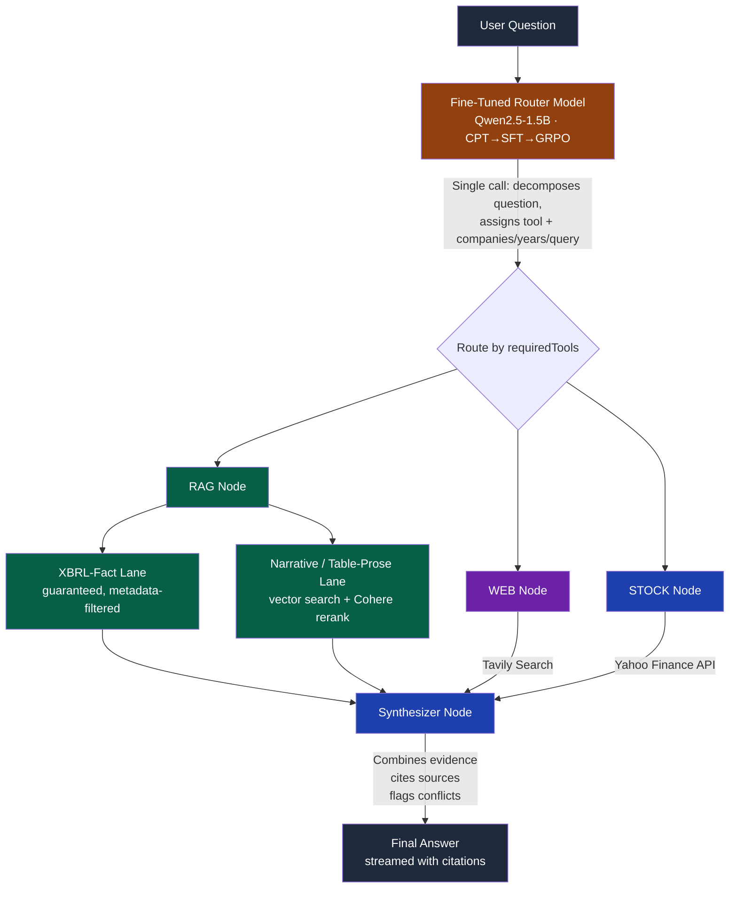

<div align="center">

# Investment Research AI

### Multi-Agent RAG System with a Self-Fine-Tuned Router

*An AI research assistant that thinks like an analyst — a custom-trained routing model decomposes
investment questions, pulls data from the right source at the right time, and cites every claim
back to its origin.*

[](https://nodejs.org/)
[](https://www.langchain.com/langgraph)
[](https://huggingface.co/IbrahimKhan7208/investment-research-router)
[](https://www.pinecone.io/)
[](https://cohere.com/)
[](https://groq.com/)

</div>

---

🚀 **[Try it live](https://investment-research-bot.vercel.app/)** · 🤗 **[Router model on Hugging Face](https://huggingface.co/IbrahimKhan7208/investment-research-router)**

## 🎯 What This Is

Most "AI finance chatbots" wrap a general-purpose LLM around a prompt. This is different in two ways.

**First, the routing layer isn't prompted — it's trained.** Instead of asking a large general model to classify every question, I fine-tuned a small model (Qwen2.5-1.5B) specifically for this task, through a full **CPT → SFT → GRPO** pipeline, and deployed it as its own inference endpoint. It replaces two LLM calls the original prototype made per question with one structured-output call, from a model an order of magnitude smaller — and it's *more* accurate at the job than the general-purpose model it replaced.

**Second, retrieval isn't just "search and hope."** SEC filings are converted through a purpose-built pipeline that treats a company's actual financial statement numbers as structured data (pulled from SEC's own XBRL layer) rather than something to re-derive by parsing HTML tables, and RAG runs a two-lane retrieval strategy that guarantees those numbers surface regardless of how a question is worded, while still using semantic search + reranking where it actually earns its keep — narrative text.

Ask something like:

> *"Compare NVIDIA vs AMD's data center revenue growth and recent stock performance"*

...and the router decomposes it, decides exactly which sources are needed (SEC filings? live market data? the web?), retrieves only what's relevant, and synthesizes a cited, evidence-backed answer — with every step of that reasoning visible live in the UI as it happens.

Built as a deep dive into production RAG architecture, model fine-tuning, and agent orchestration — not prompt engineering.

---

## 🖼️ How It Works



**Key design decision:** Every tool node is *conditionally* executed. If a question only needs stock data, the graph skips RAG and WEB entirely — no wasted LLM calls, no wasted latency. The whole run streams over Server-Sent Events, so the frontend shows the router's breakdown and each tool's retrieval math live, not just a spinner until everything finishes.

---

## ⚙️ Core Architecture

### 1. Question Decomposition — a Fine-Tuned Model, Not a Prompt

The original prototype used a 120B model for **two** separate calls: a classifier (decompose question → sub-questions + tool) and a filter-extractor (pull company/year/search-query per sub-question). Both are now replaced by **one call to a custom fine-tuned router** — Qwen2.5-1.5B, trained CPT → SFT → GRPO with PyTorch + Unsloth, deployed as its own Hugging Face Space endpoint:

```json
{
  "subQuestions": [
    {
      "question": "What was NVIDIA's data center revenue growth in FY2024?",
      "tool": "RAG",
      "companies": ["NVIDIA"],
      "years": [2024],
      "searchQuery": "data center segment revenue growth"
    },
    {
      "question": "What is NVIDIA's current stock price and 1-year performance?",
      "tool": "STOCK",
      "companies": ["NVIDIA"],
      "years": []
    }
  ],
  "requiredTools": ["RAG", "STOCK"]
}
```

Every sub-question gets exactly **one** tool; if a question would genuinely need more than one, the router splits it further rather than tagging a sub-question with multiple tools. `companies`/`years`/`searchQuery` come out already-structured for every tool, not just RAG — the original prototype only ever structured RAG sub-questions and handed WEB/STOCK a raw string.

**Benchmarked against the original two-call, 120B approach:**

| Metric | Original (120B, 2 calls) | Fine-Tuned Router (1.5B, 1 call) |
|---|---|---|
| Tool-routing accuracy (in-scope) | 61.3% | **96.8%** |
| Tool-routing accuracy (out-of-scope companies) | 23.3% (hardcoded 3-company enum) | **100%** (generalizes to any company) |
| LLM calls per question | 2 | 1 (**~35% fewer** overall) |

**Known limitation, documented rather than chased indefinitely:** alias/rename canonicalization (e.g. "Facebook" → "Meta") failed across several correction attempts during training and was left as a known gap — ticker resolution for *current* company names works reliably.

### 2. SEC Filing Ingestion — Structured Data Over Parsed Data

Filings are fetched live from **SEC EDGAR** (free, no key — a compliant `User-Agent` header and self-throttling), not manually downloaded. Ticker → CIK resolution, filing lookup, and structured metadata (filing date, period of report, form type) all come from EDGAR's own APIs, feeding directly into the same metadata-filtered retrieval design the original prototype used — just no longer hand-parsed from filenames.

**The conversion problem most pipelines miss:** SEC filing HTML uses plain `<td>` cells throughout its tables — no `<th>` header row anywhere. Standard GFM table converters (including `turndown-plugin-gfm`) require a `<th>` row to recognize a table at all, so they silently pass through raw, unconverted HTML on every real filing table. SEC tables also use `colspan`/`rowspan` for multi-level headers and blank "spacer" cells purely for `$`-sign visual alignment, which would produce a technically-valid-but-unreadable markdown table even with the `<th>` issue fixed. The fix: a custom parser (`tableToProse.js`) that grid-normalizes spans, merges spacer/currency columns, and flattens each row into a labeled prose sentence — e.g. *"Cash and cash equivalents — Jan 25, 2026: $10,605; Jan 26, 2025: $8,589."*

**The bigger realization: don't parse tables for numbers that are already structured data.** SEC requires every filer to submit a machine-readable XBRL layer alongside the document, tagging every reported figure with a standardized concept name (`Revenues`, `NetIncomeLoss`, `Assets`, etc.). `xbrlFacts.js` pulls Item 8's core financial statement figures directly from SEC's `companyfacts` API instead of re-deriving them from HTML — zero parsing risk, each fact arriving pre-attributed to its correct fiscal year.

Every chunk is tagged with `company` (ticker), `year`, `section` (SEC Item), and `sourceType` (`xbrl-fact` / `table-prose` / `narrative`) — this tagging is what makes the retrieval filtering below possible.

### 3. Two-Lane RAG Retrieval

Reranking alone wasn't sufficient. Testing surfaced a retrieval-*completeness* gap, not a relevance-ordering one: a bare question like *"What was Apple's revenue in FY2025?"* could fail entirely, because the correct `xbrl-fact` chunk never survived the vector search's stage-one top-K at all — crowded out by narrative text that also happens to mention "revenue." Reranking can only reorder what survives stage one; it can't rescue what never made the cut.

RAG retrieval now runs two lanes per sub-question:
- **`xbrl-fact` lane**: fetched via exact metadata filter (`{company, year, sourceType: "xbrl-fact"}`) — no vector-similarity competition. Only ~9 core concepts exist per company/year, so fetching all of them is cheap and *guarantees* ground-truth numbers are never crowded out by word choice.
- **narrative/table-prose lane**: wide vector search → Cohere rerank (`rerank-english-v3.0`) against the actual sub-question text — this is where reranking earns its keep, filtering a genuinely large, noisy pool of prose.

If the narrative lane comes back empty for the exact requested year (common when a question asks about a year outside the most recently ingested filings), it retries company-only rather than returning nothing, letting the synthesizer see and caveat the actual year each chunk is tagged with.

### 4. Conditional Routing (LangGraph)

Built as a state graph with conditional edges — not a fixed pipeline:

```javascript
function routeAfterRag(state) {
  const required = state.requiredTools;
  const executed = state.toolsExecuted;

  if (required.includes("WEB") && !executed.includes("WEB")) return "web";
  if (required.includes("STOCK") && !executed.includes("STOCK")) return "stock";
  return "synthesizer";
}
```

If a question only needs RAG, the graph goes straight to synthesis — WEB and STOCK nodes never execute. This isn't just an optimization; it's central to making a multi-tool agent system production-viable (fewer LLM calls = fewer rate-limit issues, lower latency, lower cost).

### 5. Evidence-First Synthesis

Every sub-answer is stored with its full source metadata — ticker, fiscal year, SEC Item/section, and `sourceType` for filings; URL for web; ticker for stock. Chunks are presented to the synthesizer in trust order (`xbrl-fact` → `table-prose` → `narrative`), with an explicit instruction to prefer the XBRL-sourced figure whenever a table-prose or narrative excerpt reports the same fact — the model is told which source is structurally more reliable, not left to guess. The synthesizer combines all evidence into one coherent, cited answer and explicitly flags conflicting information between sources rather than silently picking one.

---

## 🛠️ Tech Stack

| Layer | Technology | Why |
|---|---|---|
| **Router model** | Qwen2.5-1.5B, PyTorch + Unsloth, CPT → SFT → GRPO | Purpose-trained routing beats prompting a general model, at a fraction of the size and cost |
| **Model hosting** | Hugging Face Spaces (Gradio) | Free-tier ZeroGPU inference endpoint for the router |
| **Orchestration** | LangGraph | Conditional state machine with streaming, not a fixed pipeline or an autonomous black box |
| **LLM Inference** | Groq (`gpt-oss-120b` + `llama-3.3-70b`) | Fast model for extraction/synthesis, smart model for reasoning-heavy steps |
| **Embeddings + Rerank** | Cohere (`embed-english-v3.0`, `rerank-english-v3.0`) | Strong on financial English text; two-stage retrieval where a single vector search isn't precise enough |
| **Vector DB** | Pinecone | Metadata-filtered similarity search, 1024-dim / cosine |
| **Filing source** | SEC EDGAR (submissions + XBRL companyfacts APIs) | Free, structured, no manual document sourcing |
| **HTML processing** | Cheerio + Turndown + custom table parser | SEC's table markup breaks standard GFM converters — see Core Architecture §2 |
| **Web Search** | Tavily | Real-time news and analyst sentiment |
| **Market Data** | Yahoo Finance (`yahoo-finance2`) | Free, no-key price and historical performance, with ticker resolution via `.search()` |
| **Backend** | Node.js + Express, deployed on Render | REST + SSE streaming endpoint serving the LangGraph agent |
| **Frontend** | React, deployed on Vercel | Live streaming chain-of-thought UI |

---

## 📚 Data Coverage

**8 companies**, 3 fiscal years of 10-K filings each (2 for META, pending its most recent filing): NVIDIA, AMD, Microsoft, Apple, Alphabet, Amazon, Tesla, Meta.

**~14,500 chunks** across all companies — narrative, table-prose, and XBRL-fact sourced. XBRL facts alone span a much deeper history per company (10-20+ years) since SEC's companyfacts API returns full comparative disclosure history regardless of how many individual filings were fetched for narrative content.

---

## 💡 What I Learned Building This

- **Fine-tuning a small model can beat prompting a large one — if the task is narrow enough.** A 1.5B model trained specifically for routing outperformed a 120B model prompted for the same task, on both accuracy and cost.
- **"Convert HTML to Markdown" is not one problem.** Off-the-shelf tools assume clean semantic markup (`<th>` for headers); real-world documents like SEC filings don't provide it, and that failure mode is silent, not an error you'll notice without checking actual output.
- **Structured data beats parsed data whenever it's available.** Pulling XBRL facts directly, instead of reverse-engineering the same numbers from HTML tables, eliminated an entire category of parsing risk for the figures that matter most.
- **Reranking fixes relevance ordering, not retrieval completeness.** A narrow top-K at the vector-search stage can silently drop something reranking never gets a chance to save — the fix was architectural (a guaranteed lane for ground-truth facts), not a bigger K.
- **Metadata design determines what's actually findable.** Tagging narrative chunks with only the ingesting filing's year (not every year they discuss) created a real, reproducible retrieval gap for older data — fixed by ingesting multiple years of filings per company, not by cleverer filtering alone.
- **Evidence and reasoning visibility should be built in, not bolted on.** Streaming the graph's actual execution turned out to be as important for trust and debugging as retrieval quality itself.

---

## 🚧 Current Limitations & Next Steps

- Router alias-canonicalization gap (renamed companies like "Facebook" → "Meta") — documented, not solved; ticker resolution for current names is reliable
- Router occasionally defaults relative-time language ("recent") to a specific year rather than the true latest year — likely a training-data distribution artifact, not yet root-caused
- Table-prose/narrative chunks are tagged with their filing's own year, not every year discussed inside them — mitigated by ingesting multiple filings per company and a company-only search fallback, not fully eliminated
- No formal retrieval evaluation pipeline yet — testing has been targeted manual probing against known-answer questions, not a benchmark suite
- Synthesizer model (separately DPO-trained) built but not yet integrated — HuggingFace free-tier ZeroGPU caps at 2 models per Space, so this is deliberately deferred
- Grounding/hallucination verifier (planned GRPO-trained citation checker) not yet started

---

<div align="center">

**Built to go deep on model fine-tuning, production RAG, and agent orchestration — from CPT to a live, streaming multi-agent system.**

</div>